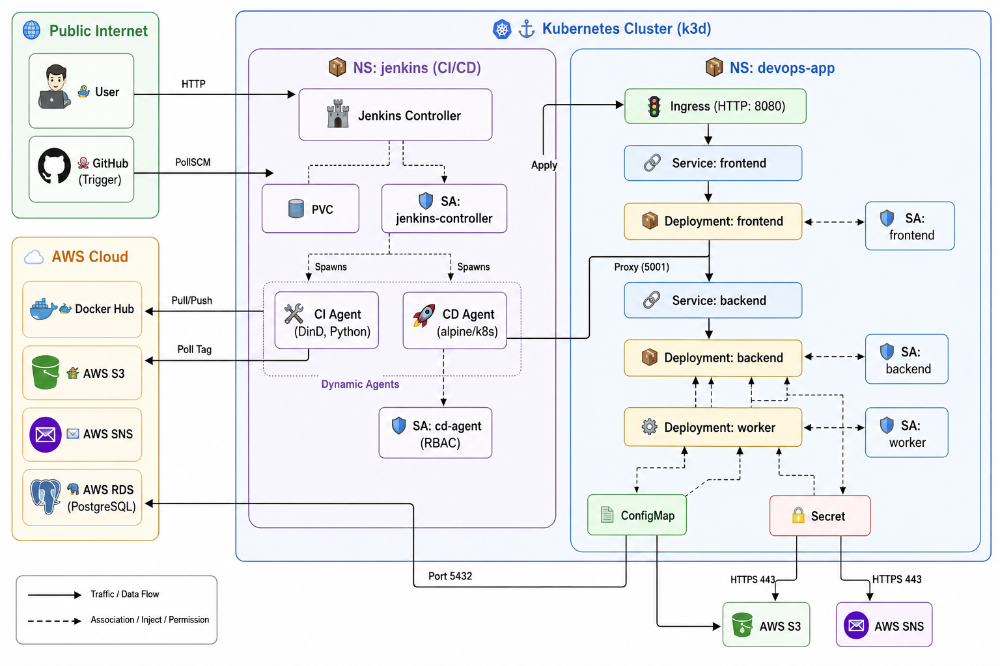
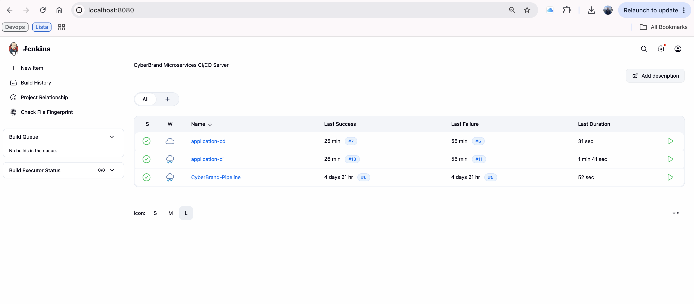
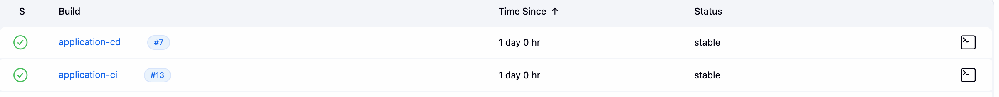
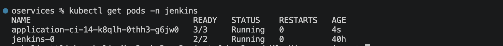
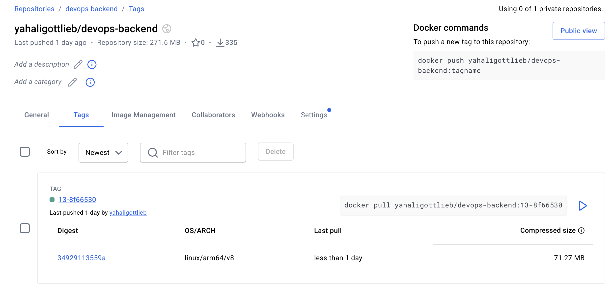
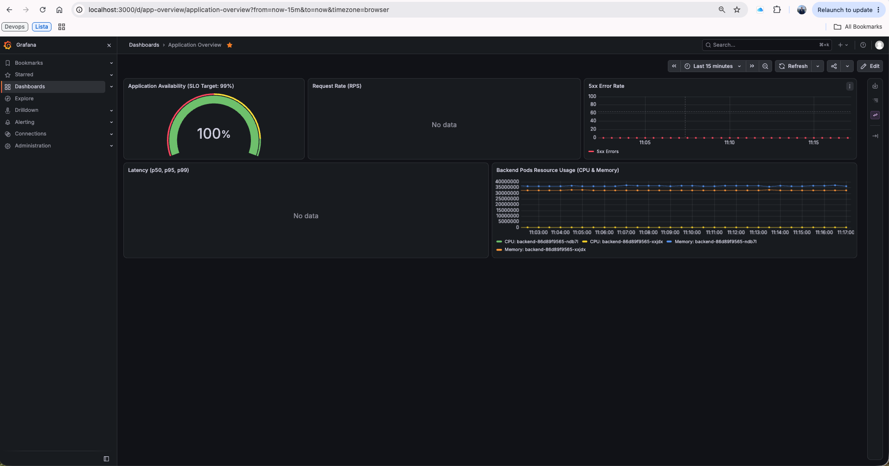
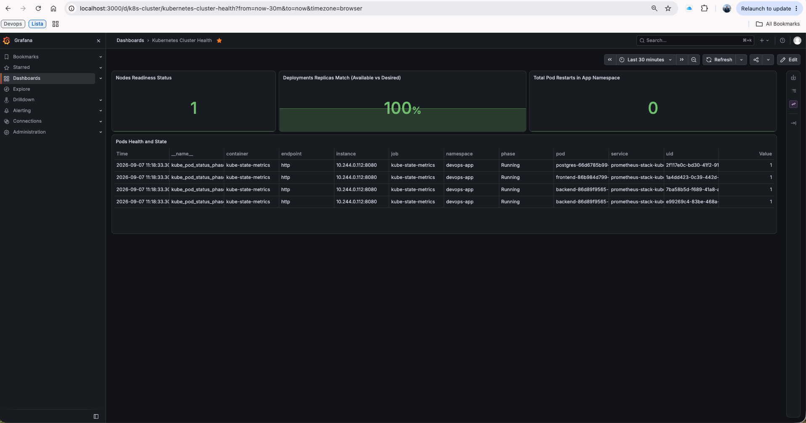
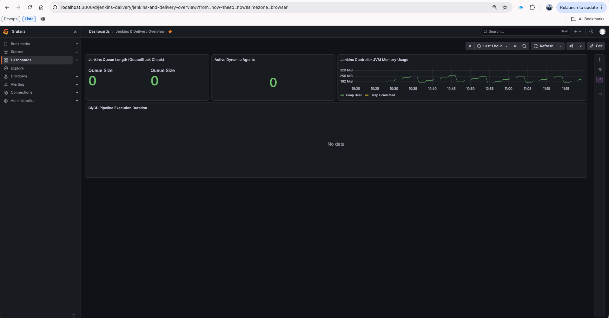
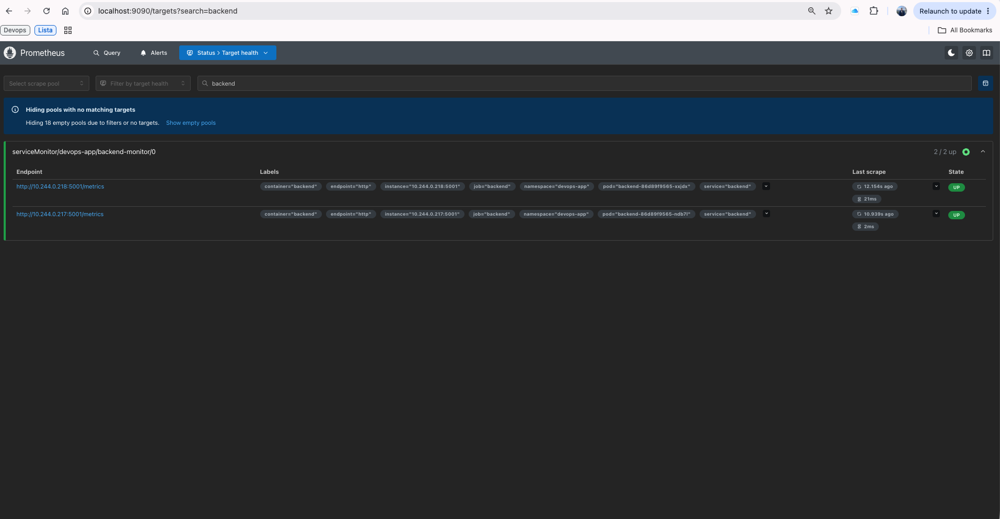
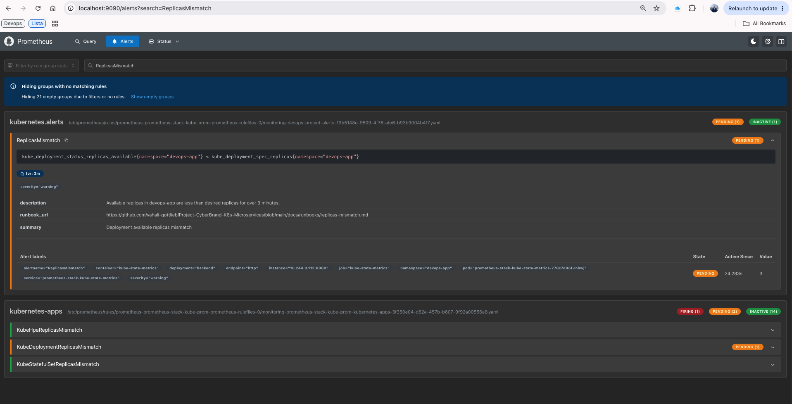

# Project-CyberBrand-K8s-Microservices

**Author:** Yahali  
**Assignment:** DevOps on AWS - Task 3, Task 4 & Final Project Task 5 (Kubernetes, CI/CD & Observability)

## Project Overview

This project transitions our 3-tier cloud application into a modern containerized environment using **Docker** and **Kubernetes**, introduces a fully automated **Jenkins CI/CD Pipeline**, and implements a complete **GitOps-driven Observability Stack** using Prometheus and Grafana.

We migrated from running services directly on standalone EC2 instances to deploying them as containerized Pods within a local Kubernetes cluster (k3d), integrating securely with AWS managed services (RDS, S3, and SNS).

The primary goal of this phase is to establish a robust, highly available, dynamically scaling, deeply secured, and fully monitored architecture using Infrastructure as Code (IaC), GitOps principles, and Kubernetes best practices.

---

## 🏗️ Architecture & Traffic Flow

The system is deployed on a local k3d Kubernetes cluster representing an On-Premise environment, integrated with AWS Cloud Services.

### 1. Application Traffic Flow — Namespace: `devops-app`

* **Public Internet → Ingress:** External users can only reach the Kubernetes Ingress Controller via HTTP.
* **Ingress → Frontend:** The Ingress routes external traffic exclusively to the `frontend` Service.
* **Frontend → Backend:** The Frontend Nginx server acts as a reverse proxy, forwarding specific API calls (`/api/`) internally to the `backend` Service. External users cannot reach the backend directly.
* **Backend → RDS/Postgres:** The Backend pod communicates outbound to the external AWS RDS PostgreSQL database (or local K8s Postgres for dev/testing) on Port 5432 for reading and writing game scores.
* **Worker → AWS Services:** The Worker pod has no inbound communication. It is a scheduled process that communicates outbound to:
  * **AWS RDS PostgreSQL** — Port 5432
  * **AWS S3** — HTTPS 443
  * **AWS SNS** — HTTPS 443

### 2. CI/CD Pipeline Flow — Namespace: `jenkins`

* **Continuous Integration (`application-ci`):** Triggered automatically by a Git `pollSCM` mechanism. Runs on an ephemeral Docker-in-Docker (DinD) agent. It builds the Docker images, assigns an immutable tag (`BUILD_NUMBER-COMMIT_SHA`), and pushes them to Docker Hub.
* **Continuous Deployment (`application-cd`):** Triggered by the CI pipeline. Runs on an ephemeral alpine/k8s agent. It securely applies the Kubernetes manifests, updates the target deployments using the immutable image tag, and validates the deployment against a **Prometheus Monitoring Gate**.

### 3. Observability Flow — Namespace: `monitoring`

* **Metrics Collection:** The Prometheus Operator dynamically discovers endpoints using `ServiceMonitors` targeting the Application (`backend-monitor`), Jenkins (`jenkins-monitor`), and Kubernetes cluster states (`kube-state-metrics`).
* **Dashboards & Alerts:** Grafana and Alertmanager process these metrics to provide real-time visualization and incident routing based on pre-defined SLIs and SLOs.

---

## 👁️ Monitoring, Observability & SLI/SLO (Task 5)

A complete zero-UI Observability stack is implemented using the `kube-prometheus-stack`, managed entirely via GitOps.

### Dashboards as Code

Grafana is provisioned with a Sidecar container that automatically loads dashboards from Kubernetes ConfigMaps. No manual UI imports are required.

* **Application Overview:** Tracks RPS, 5xx Error Rates, p50/p95/p99 Latency, and overall Application Availability (SLO Target: 99%).
* **Kubernetes Cluster Health:** Monitors Nodes Readiness, Deployments Replicas Match, Pod Restarts, and Pod phases.
* **Jenkins & Delivery:** Tracks Jenkins Queue Length (stuck jobs detection), Active Dynamic Agents, JVM Memory, and CI/CD Execution duration.

### Alerting Rules & Runbooks

Prometheus `PrometheusRule` Custom Resources define the alerting logic using PromQL. Every alert is explicitly linked to a Markdown Runbook (`docs/runbooks/`) detailing diagnosis and rollback procedures.

* **Application Alerts:** `HighErrorRate` (>5% 5xx errors), `HighLatencyP95` (breaching 2s threshold).
* **Cluster Alerts:** `ReplicasMismatch` (available < desired), `NodeNotReady`.
* **Pipeline & Infra Alerts:** `JenkinsQueueStuck`, `PrometheusTargetDown`.

### 💾 Storage, Retention & Recovery

* **Storage Allocation:** Prometheus is backed by a 10Gi Persistent Volume Claim (PVC).
* **Data Retention:** The TSDB retention period is set to `10d` (10 days) for optimal trend analysis and cost management.
* **Disaster Recovery:** If the Prometheus Pod is deleted, it automatically spins up and reattaches to the PVC with zero data loss. If the PVC itself is lost, the entire monitoring infrastructure (Dashboards, Rules, Scrapers) will automatically recover its configuration from Git seamlessly.

---

## 🔒 Deep Security Implementation

A significant portion of this project focuses on securing the Kubernetes cluster and the CI/CD flow, directly addressing previous security reviews.

### 1. Privilege Separation — Service Accounts & RBAC

* **Application Service Accounts:** Dedicated Service Accounts are used:
  * `frontend-sa`
  * `backend-sa`
  * `worker-sa`
  * *The Backend explicitly does not receive AWS credentials, adhering to the principle of Least Privilege.*
* **Jenkins CD Agent:** The CD deployment runs under `cd-agent-sa`, which is strictly scoped to the `devops-app` namespace via a RoleBinding, with specific permissions to manage `ServiceMonitor` resources in the `jenkins` namespace.
  * *No cluster-admin rights are used.*

### 2. Zero-Trust Network Policies

* **Default Deny:** A strict `NetworkPolicy` enforces a Default Deny for all Ingress and Egress traffic in the `devops-app` namespace.
* **Explicit Allowances:** Rules explicitly allow:
  * DNS resolution
  * Ingress traffic to the frontend
  * Frontend-to-backend communication
  * Backend/Worker access to AWS RDS (or local DB) on Port 5432
  * Worker HTTPS access to AWS S3/SNS on Port 443
  * **Prometheus Scraping:** Specifically allowing the monitoring namespace to scrape backend metrics.
  * **CD Smoke Tests:** Allowing the Jenkins CD agent to verify application health post-deployment.

### 3. Secrets Management — Zero Hardcoded Secrets

* Hardcoded database passwords were completely removed from Terraform and the Python codebase.
* Passwords and credentials must be injected via Kubernetes Secrets and Terraform variables.
* Example secrets (`secret.example.yaml`) have been moved to an `examples/` directory to prevent accidental overwrites during the automated `kubectl apply -f k8s/` CD rollout.
* Sensitive credentials are never committed directly to Git.

### 4. Container & Image Security

* **Immutable Image Tags:** We strictly avoid the `latest` tag in our deployments. Images are tagged using an immutable format: `BUILD_NUMBER-COMMIT_SHA`.
* **Non-Root Execution:** All containers enforce `runAsNonRoot: true`.
  * Backend/Worker run as UID 1000
  * Nginx runs as UID 101
* **Privilege Escalation:** Disabled across all containers using: `allowPrivilegeEscalation: false`.

---

## 🌟 Advanced Kubernetes Features

### Pod Disruption Budget — PDB

A Pod Disruption Budget (PDB) is configured for the backend to guarantee `minAvailable: 1`. This ensures that at least one backend replica remains available during voluntary cluster disruptions.

### Horizontal Pod Autoscaler — HPA

The frontend is configured with a Horizontal Pod Autoscaler (HPA). The HPA dynamically scales the frontend deployment between:

* **Minimum replicas:** 1
* **Maximum replicas:** 3
* **CPU target utilization:** 70%

This allows the application to automatically respond to increased traffic and workload.

---

## 🚀 Instructions: How to Deploy from Scratch

### Prerequisites

Before starting, make sure the following tools are installed:

* Docker & k3d
* `kubectl` & Helm
* Terraform
* An active AWS Account & Docker Hub account

### Step 1: Provision AWS Infrastructure with Terraform

Navigate to the Terraform directory and create the AWS resources:

```bash
cd terraform
terraform init

# Provide a secure password for the RDS database
terraform apply -var="db_password=YOUR_SECURE_PASSWORD"
```

### Step 2: Bootstrap the Kubernetes Cluster

Create the local k3d Kubernetes cluster:

```bash
k3d cluster create devops-cluster -p "8080:80@loadbalancer"
```

Create the required Kubernetes namespaces:

```bash
kubectl apply -f k8s/01-namespace.yaml
```

### Step 3: Inject Secrets & Configurations

Update `k8s/02-configmap.yaml` with the AWS resources created by Terraform.

Create the Kubernetes Secret securely:

```bash
kubectl create secret generic devops-secrets -n devops-app \
  --from-literal=DB_USER=postgres \
  --from-literal=DB_PASS=YOUR_SECURE_PASSWORD \
  --from-literal=AWS_ACCESS_KEY_ID=YOUR_AWS_KEY \
  --from-literal=AWS_SECRET_ACCESS_KEY=YOUR_AWS_SECRET
```

> **Security Note:** Never commit real AWS credentials, database passwords, or other secrets to Git.

### Step 4: Install Jenkins & Monitoring (Helm)

#### Jenkins (JCasC)

Jenkins is installed and fully configured as code using Helm and Jenkins Configuration as Code (JCasC). No manual UI setup is required for plugins or jobs.

```bash
helm repo add jenkins https://charts.jenkins.io
helm repo update
helm upgrade --install jenkins jenkins/jenkins -n jenkins -f jenkins/values.yaml
```

#### Prometheus Stack

```bash
helm repo add prometheus-community https://prometheus-community.github.io/helm-charts
helm repo update
helm upgrade --install prometheus-stack prometheus-community/kube-prometheus-stack -n monitoring -f monitoring/prometheus-values.yaml
```

Access Jenkins at `http://localhost:8080` (requires port-forwarding):

```bash
kubectl port-forward svc/jenkins 8080:8080 -n jenkins
```

Retrieve the Jenkins Admin Password:

```bash
kubectl exec --namespace jenkins -it svc/jenkins -c jenkins -- \
  /bin/cat /run/secrets/additional/chart-admin-password && echo
```

### Step 5: Trigger the CI/CD Pipeline

The following Jenkins jobs are automatically created using Jenkins Job DSL:

* `application-ci`
* `application-cd`

Simply push a commit to the `main` branch of the repository. The `pollSCM` trigger will detect the change and start the CI/CD process.

#### CI Pipeline

1. Detects the Git change.
2. Starts an ephemeral Docker-in-Docker agent.
3. Checks out the source code & builds the Docker images.
4. Generates immutable image tags (`BUILD_NUMBER-COMMIT_SHA`).
5. Pushes the images to Docker Hub.
6. Triggers the CD pipeline.

#### CD Pipeline

1. Starts an ephemeral alpine/k8s agent.
2. Pulls the required image tag.
3. Applies the Kubernetes manifests.
4. Updates the Kubernetes deployments & performs the deployment rollout.
5. Runs the **Post-Deploy Monitoring Gate** to ensure target health in Prometheus.

---

## 🛠️ Rollback Procedure

If a CD rollout fails or an Alertmanager incident triggers (e.g., `HighErrorRate` or `ReplicasMismatch`), execute the native Kubernetes rollback mechanism as defined in the Runbooks:

```bash
kubectl rollout undo deployment/backend -n devops-app
kubectl rollout undo deployment/frontend -n devops-app
```

---

## 🧹 Environment Cleanup

To safely tear down the entire environment:

```bash
k3d cluster delete devops-cluster
cd terraform && terraform destroy
```

> **Warning:** `terraform destroy` permanently removes the AWS infrastructure.

---

## 📸 Project Screenshots

### Kubernetes Base — Task 3
1. **Kubernetes Cluster Nodes:**


2. **Namespaces:**


3. **Pods Status & Health:**


4. **Deployments Status:**


5. **Services (ClusterIP):**


6. **Ingress Controller:**


7. **Self-Healing (Post-Delete):**


8. **Frontend UI Running:**


9. **AWS RDS (DB Available):**


10. **AWS S3 (Automated Report):**


11. **AWS SNS (Email Alert):**


### Jenkins CI/CD — Task 4
12. **Architecture Diagram:**


13. **Jenkins Jobs Created (JCasC):**


14. **CI & CD Pipeline Success:**


15. **Dynamic Agents Running in Kubernetes:**


16. **Docker Hub Immutable Tags:**


### Observability & Monitoring — Final Project Task 5
17. **Grafana Application Overview:**


18. **Grafana Kubernetes Cluster Health:**


19. **Grafana Jenkins Delivery:**


20. **Prometheus Targets UP:**


21. **Prometheus Alerts Firing (Failure Drill):**


---

## 🎯 Final Result

The completed architecture provides a secure and automated Kubernetes-based application platform with a fully integrated CI/CD pipeline and an automated Observability stack.

The application is deployed into isolated Kubernetes namespaces, protected by RBAC and NetworkPolicies, uses dedicated Service Accounts and Kubernetes Secrets, runs containers as non-root users, and communicates with external services through explicitly defined network paths.

The Jenkins pipeline automates the complete lifecycle:

**Git commit → Docker build → Immutable image → Docker Hub → Kubernetes deployment → Rollout → Prometheus health verification**

This provides a repeatable, observable, and deeply secure deployment process.