# Project-CyberBrand-K8s-Microservices


**Author:** Yahali

## Project Overview
This project transitions our 3-tier cloud application into a modern containerized environment using **Docker** and **Kubernetes**. We migrated from running services directly on standalone EC2 instances to deploying them as containerized Pods within a Kubernetes cluster, integrating securely with AWS managed services (RDS, S3, and SNS). 

The primary goal of this phase is to establish a robust, highly available, and deeply secured architecture using Infrastructure as Code (IaC) and Kubernetes best practices.

---

## Architecture & Traffic Flow
The application is deployed in a dedicated Kubernetes Namespace (`devops-app`) and consists of three main microservices interacting with three external AWS services.

### Traffic Flow & Network Security
To ensure a hardened network perimeter, communication is strictly limited based on the principle of least privilege:
1. **Public Internet -> Ingress:** External users can only reach the Kubernetes Ingress Controller via HTTP/HTTPS.
2. **Ingress -> Frontend:** The Ingress routes external traffic exclusively to the `frontend` Service.
3. **Frontend -> Backend:** The Frontend Nginx server acts as a reverse proxy, forwarding specific API calls (`/api/`) internally to the `backend` Service. External users **cannot** reach the backend directly.
4. **Backend -> RDS:** The Backend pod communicates outbound to the external AWS RDS PostgreSQL database (Port 5432) for reading/writing game scores.
5. **Worker -> AWS Services:** The Worker pod has no inbound communication. It is a scheduled process that communicates outbound to AWS RDS (Port 5432), AWS S3 (HTTPS), and AWS SNS (HTTPS).

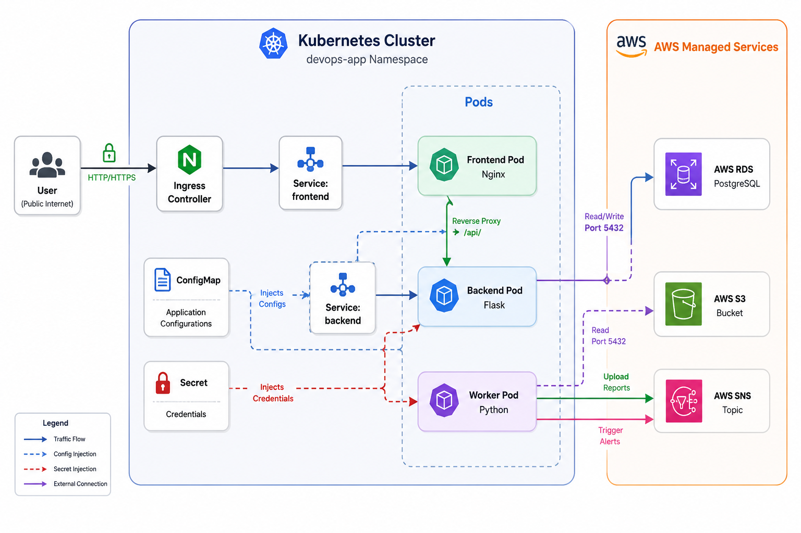

---

## Kubernetes Resources Created
*   **Namespace (`01-namespace.yaml`):** A dedicated `devops-app` namespace isolates the environment. The `default` namespace is explicitly avoided to prevent cross-contamination and improve security.
*   **ConfigMap (`02-configmap.yaml`):** Decouples non-sensitive configuration (AWS Region, S3 Bucket name) from the application code.
*   **Secrets (`03-secret.yaml`):** Stores sensitive data (RDS passwords, AWS Keys) securely.
*   **Deployments & Services (`04-backend.yaml`, `05-worker.yaml`, `06-frontend.yaml`):** Manages the Pods and `ClusterIP` services to handle internal routing.
*   **Ingress:** Exposes the Frontend service to the public internet securely.

---

## Deep Security Implementation & Trade-offs

A significant portion of this project focuses on securing the Kubernetes cluster. The following measures were implemented:

### 1. Privilege Separation (Service Accounts & RBAC)
*   **Dedicated Service Accounts:** Instead of using the default service account, each deployment uses its own dedicated Service Account (`frontend-sa`, `backend-sa`, `worker-sa`). 
*   **Why?** This ensures strict privilege separation. By doing this, we lay the foundation for IAM Roles for Service Accounts (IRSA) on AWS EKS. The `worker-sa` can be mapped directly to an AWS IAM Role with S3/SNS permissions, ensuring the frontend and backend have absolutely no AWS access.
*   **Zero Cluster-Admin:** No application or pod is granted `cluster-admin` rights.

### 2. Container & Image Security
*   **Image Tags:** We strictly avoid the `latest` tag. All images are built and pushed with explicit versioning (e.g., `v1`) to ensure predictable deployments and rollback capabilities.
*   **Non-Root Execution:** All containers enforce `runAsNonRoot: true`. The backend and worker run as UID `1000`, and the Nginx frontend runs as UID `101` (Nginx unprivileged user).
*   **Privilege Escalation:** Disabled across all containers using `allowPrivilegeEscalation: false` to prevent child processes from gaining more privileges than their parent process.

### 3. Secrets Management
*   **Methodology:** We utilize native Kubernetes `Secrets` for database credentials and AWS access keys. 
*   **Git Security:** Real secrets are never pushed to Git. A `secret.example.yaml` is provided in the repository to document the required structure. The actual `03-secret.yaml` is explicitly ignored via `.gitignore`.
*   **Trade-off:** Native Kubernetes Secrets are base64 encoded, not encrypted at rest by default. For a true production environment, a better approach would be integrating **AWS Secrets Manager** with the *External Secrets Operator*, or using *Sealed Secrets* to allow safe GitOps workflows. 

### 4. Application Stability
*   **Probes:** Both `livenessProbe` and `readinessProbe` are implemented for all backend and worker services. This ensures Kubernetes only routes traffic to healthy containers and auto-restarts failed ones.
*   **Resource Management:** Explicit `requests` and `limits` (CPU and Memory) are defined for every container. This prevents noisy-neighbor scenarios and protects the cluster nodes from CPU/Memory exhaustion.

### 5. Ingress Security Trade-off
*   **Trade-off:** Currently, the Ingress operates over HTTP. In a fully production-ready environment, we would implement **HTTPS/TLS** termination at the Ingress level using `cert-manager` (Let's Encrypt) or AWS ACM. This was omitted to reduce scope complexity as it requires a registered domain name.

---

## 🌟 Advanced Features & Bonus Implementations

To further enhance the cluster's security, high availability, and scalability, the following advanced Kubernetes configurations were implemented beyond the base requirements:

*   **Network Policies (`07-network-policy.yaml`):** Implemented an internal firewall (Zero-Trust approach) ensuring that the `backend` pods only accept ingress traffic strictly from the `frontend` pods. All other internal or external cluster traffic to the backend is explicitly denied.
*   **Pod Disruption Budget - PDB (`08-pdb.yaml`):** Configured a PDB for the backend deployment to guarantee that at least one replica remains available (`minAvailable: 1`) during voluntary cluster disruptions, node drains, or updates. This ensures zero downtime for the core API.
*   **Horizontal Pod Autoscaler - HPA (`09-hpa.yaml`):** Configured dynamic autoscaling for the frontend deployment. The HPA monitors CPU resources and automatically scales the frontend pods (between 1 to 3 replicas) if the average CPU utilization exceeds 70%, ensuring the application remains responsive under heavy player load.


## Instructions: How to Run the Project

### 1. Build and Push Docker Images
Custom Dockerfile configurations are included in the repository. Run the following commands to build and push the images to Docker Hub:
```bash
# Frontend
docker build -t yahaligottlieb/devops-frontend:v1 ./ansible/app/frontend
docker push yahaligottlieb/devops-frontend:v1

# Backend
docker build -t yahaligottlieb/devops-backend:v1 ./ansible/app/backend
docker push yahaligottlieb/devops-backend:v1

# Worker
docker build -t yahaligottlieb/devops-worker:v1 -f ./ansible/app/backend/Dockerfile.worker ./ansible/app/backend
docker push yahaligottlieb/devops-worker:v1
```

### 2. Configure Secrets
1. Copy the example template: 
   `cp k8s/secret.example.yaml k8s/03-secret.yaml`
2. Insert your live AWS Access Keys and RDS Database credentials into `03-secret.yaml`.
3. Ensure your `.gitignore` is tracking `03-secret.yaml` to prevent accidental commits.

### 3. Deploy to Kubernetes
Apply the YAML manifests in order to establish the environment:
```bash
# Apply base infrastructure and services:
kubectl apply -f k8s/01-namespace.yaml
kubectl apply -f k8s/02-configmap.yaml
kubectl apply -f k8s/03-secret.yaml
kubectl apply -f k8s/04-backend.yaml
kubectl apply -f k8s/05-worker.yaml
kubectl apply -f k8s/06-frontend.yaml

# Apply Advanced/Bonus Configurations:
kubectl apply -f k8s/07-network-policy.yaml
kubectl apply -f k8s/08-pdb.yaml
kubectl apply -f k8s/09-hpa.yaml

# Alternatively, apply the entire directory at once:
# kubectl apply -f k8s/
```

---


## Testing and Verification
Run the following commands to prove the system is fully operational:
```bash
kubectl get nodes
kubectl get namespaces
kubectl get pods -n devops-app
kubectl get deployments -n devops-app
kubectl get services -n devops-app
kubectl get ingress -n devops-app
```
To view logs or troubleshoot a specific pod:
```bash
kubectl logs <pod-name> -n devops-app
kubectl describe pod <pod-name> -n devops-app
```
Access the application through the provisioned Ingress IP/Hostname via your browser. Play a game and verify that the backend successfully records the score to RDS, and check your S3/Email for the Worker's automated report.

---

## Environment Cleanup (Teardown)
To cleanly remove all resources from the cluster and avoid conflicts in future deployments:
```bash
kubectl delete -f k8s/
```

## Project Screenshots

**1. Kubernetes Cluster Nodes:**
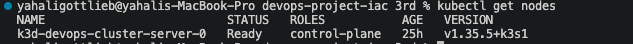

**2. Kubernetes Namespaces (`devops-app` isolation):**
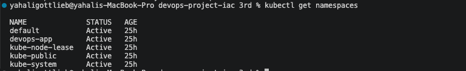

**3. Pods Status & Health:**
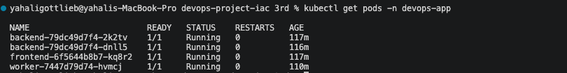

**4. Deployments Status:**
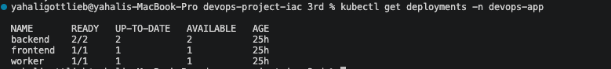

**5. Services (ClusterIP Internal Routing):**
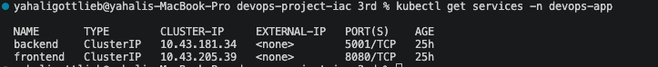

**6. Ingress Controller (Public Gateway):**
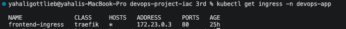

**7. Self-Healing & Pod Recovery (Post-Delete):**
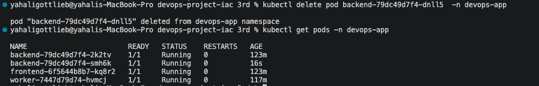

**8. CyberBrand Trivia Game (Frontend UI Running):**
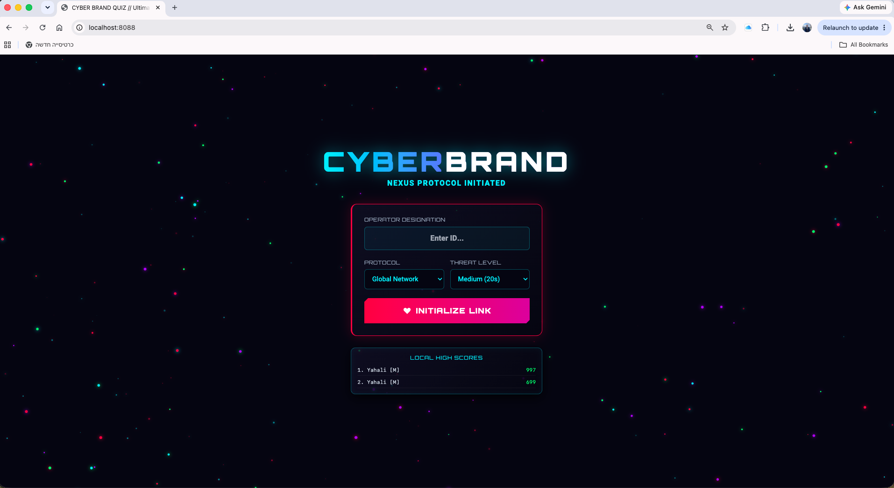

**9. AWS RDS PostgreSQL (Database Available):**
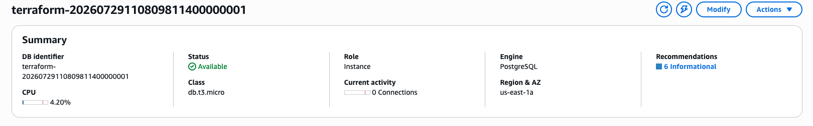

**10. AWS S3 Bucket (Automated Leaderboard CSV Report):**
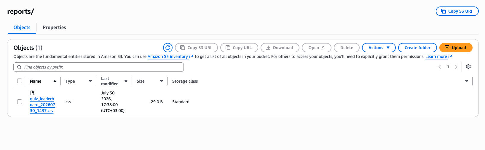

**11. AWS SNS (Automated Email Alert Success):**
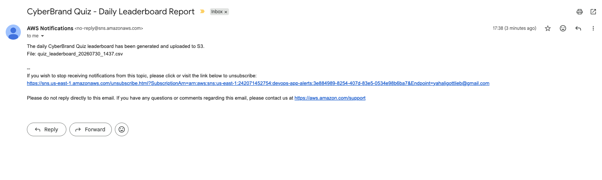
